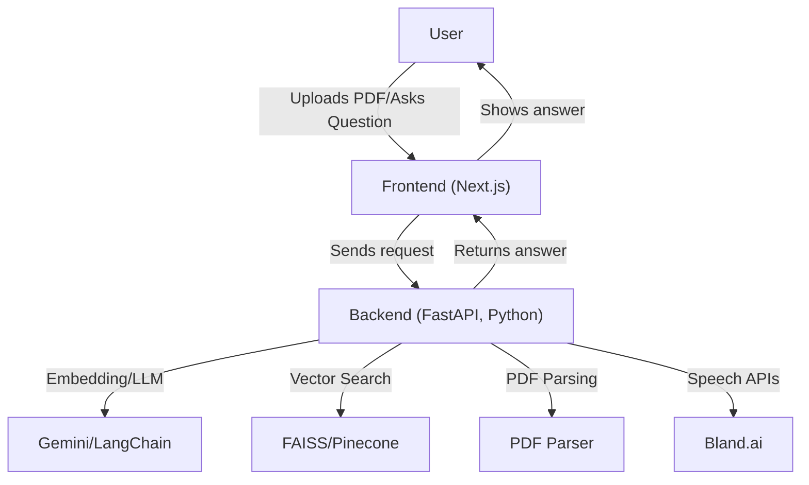

Legally: Empowering Access to Legal Knowledge

Legally is a full-stack AI-powered legal assistant focused exclusively on Indian law, court cases, and the Indian judiciary. It empowers users to interact with legal documents, ask legal questions, and even get voice-based legal help—all through a modern web interface.


---

## 🚀 Features

- **Chat with PDF:** Upload Indian legal documents (court cases, notices, contracts, etc.) and ask questions about their content.
- **AI Chatbot:** Get answers to general legal questions about Indian law, the Indian Constitution, and Indian legal procedures.
- **Call Bot:** Voice-based legal assistant for real-time legal help (Indian law only).

---

## 🏗️ Tech Stack

- **Frontend:** Next.js (React), Tailwind CSS, React-Markdown
- **Backend:** Python (FastAPI), Google Gemini (Generative AI), LangChain, PyPDF2
- **Vector Search:** FAISS (local) or Pinecone (cloud)
- **Voice/Call:** Bland.ai (API integration)
- **Deployment:** Vercel (frontend), Render (backend)

---

## 🖥️ System Architecture



---

## 📂 Key Files & Directories

- `app/(site)/chat/` – Chat UI for AI chatbot
- `app/(site)/consult/` – PDF Q&A (upload and ask about legal docs)
- `app/(site)/talk/` – Call bot (voice legal assistant)
- `bot/app.py` – Main FastAPI backend (all endpoints)
- `bot/langchain_helper.py` – Handles Gemini, vector search, and PDF logic
- `bot/requirements.txt` – Backend dependencies

---

## ⚡ Quickstart

### 1. Backend (FastAPI + Gemini)

```bash
cd bot
python -m venv venv
venv\Scripts\activate  # Windows
pip install -r requirements.txt
# Set your environment variables (see below)
uvicorn app:app --reload
```

**Environment variables required:**

- `GEMINI_API_KEY` (Google Gemini API key)
- `BLAND_API_KEY` (Bland.ai API key, for call bot)

Set these in a `.env` file or your deployment dashboard.

---

### 2. Frontend (Next.js)

```bash
npm install
npm run dev
# Visit http://localhost:3000
```

Update API URLs in the frontend to point to your deployed backend (e.g., `https://legally.onrender.com`).

---

### 3. Call Bot

- The call bot is integrated via the `/talk` endpoint and uses Bland.ai.
- Make sure your `BLAND_API_KEY` is set in the backend environment.

---

## 🌐 Deployment

- **Frontend:** Deploy on [Vercel](https://vercel.com/)  
  (e.g., https://legally-9kei.vercel.app/)
- **Backend:** Deploy on [Render](https://render.com/)  
  (e.g., https://legally.onrender.com)
- Set all required environment variables in your deployment dashboards.

---

## 🔒 Security & Best Practices

- **API keys** are loaded from environment variables—never hardcode secrets in code.
- **CORS** is configured to allow only your deployed frontend.
- **AI answers** are strictly limited to Indian law, Indian court cases, and the Indian judiciary. Non-legal or foreign queries are politely refused.

---

## 🤝 Get Involved

Legally welcomes collaboration from legal experts, developers, and organizations committed to access to justice in India.  
**Contact:** baibhavsureka1@gmail.com

---

## 📜 License

MIT License (or your preferred license)

---

**Legally: Empowering Access to Indian Legal Knowledge for All.**
